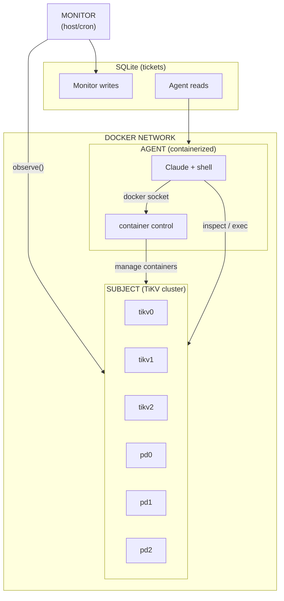
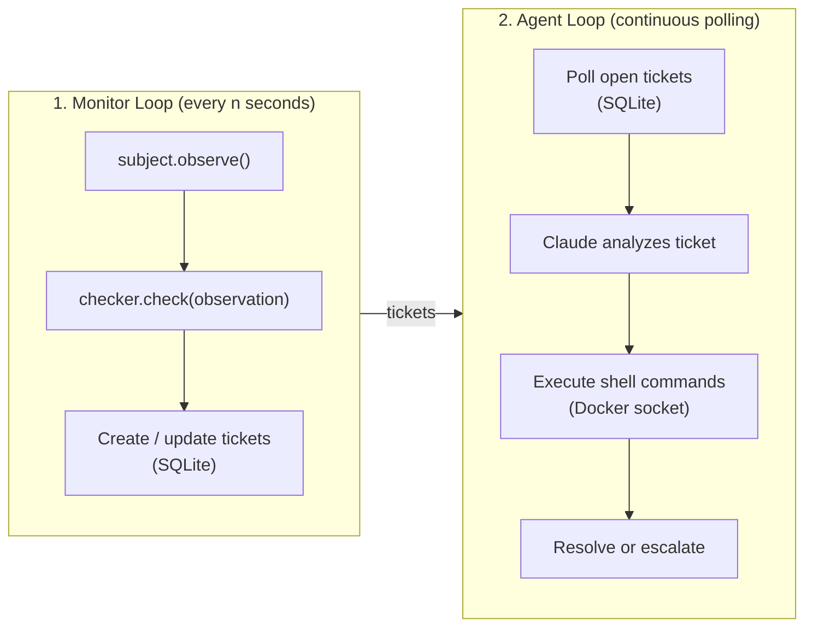
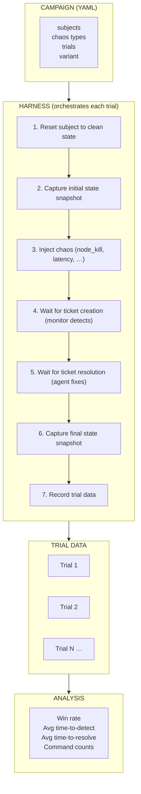

# Operator

An autonomous AI system for monitoring and remediating distributed systems. Operator continuously observes infrastructure, detects invariant violations, and uses Claude to diagnose and fix issues via shell commands.

## Architecture

Operator implements a three-component control loop:



### Components

| Component | Description |
|-----------|-------------|
| **Monitor** | Daemon that polls the subject at regular intervals, checks invariants, and creates tickets for violations |
| **Agent** | Containerized AI (Claude) that processes tickets, diagnoses issues, and executes shell commands to remediate |
| **Subject** | The distributed system being monitored (TiKV cluster, rate limiter, etc.) |

### Data Flow



## Demo

The demo provides an interactive terminal UI that walks through a complete fault injection and recovery cycle.

### What It Does

1. **Shows cluster health** — Displays baseline metrics for a healthy cluster
2. **Generates load** — Starts a YCSB workload against the cluster
3. **Injects a fault** — Kills a TiKV node (or rate limiter node)
4. **Detects the issue** — Monitor identifies the invariant violation and creates a ticket
5. **AI diagnoses** — Claude analyzes metrics, logs, and cluster state
6. **Recovers** — Agent executes remediation commands (e.g., restart the node)
7. **Verifies health** — Shows the cluster returned to a healthy state

### Running the Demo

```bash
# TiKV cluster demo (default)
./scripts/run-demo.sh tikv

# Rate limiter demo
./scripts/run-demo.sh ratelimiter
```

The script handles:
- Starting the Docker Compose stack (cluster + observability)
- Clearing any existing tickets
- Launching the interactive TUI

### Requirements

- Docker and Docker Compose
- Python 3.12+
- `uv` package manager
- Anthropic API key in environment

## Evaluation System

The eval system runs structured experiments (campaigns) to measure agent performance across different fault scenarios.

### Architecture



### Key Concepts

| Concept | Description |
|---------|-------------|
| **Campaign** | A batch of trials testing a subject against specific chaos types |
| **Trial** | A single run: inject fault → detect → remediate → verify |
| **Variant** | Agent configuration (model, system prompt) for A/B testing |
| **Baseline** | Trials without agent intervention to measure self-healing |

### Running Campaigns

**Define a campaign config (YAML):**

```yaml
name: tikv-chaos-eval
subjects: [tikv]
chaos_types:
  - type: node_kill
  - type: latency
    params: {min_ms: 50, max_ms: 150}
trials_per_combination: 5
parallel: 2
cooldown_seconds: 10
include_baseline: true
variant: default
```

**Run the campaign:**

```bash
# Run campaign from config
eval run campaign config.yaml

# Or run a single trial
eval run --subject tikv --chaos node_kill --trials 1
```

**Analyze results:**

```bash
# Show campaign summary
eval analyze <campaign_id>

# Compare two campaigns
eval compare <campaign_1> <campaign_2>

# Compare agent vs baseline (self-healing)
eval compare-baseline <campaign_id> --baseline <baseline_id>

# Compare variants across same chaos type
eval compare-variants tikv node_kill

# Browse results in web UI
eval viewer --port 8000
```

### Chaos Types

| Type | Description |
|------|-------------|
| `node_kill` | Kills a cluster node (docker kill) |
| `latency` | Injects network latency (tc netem) |
| `disk_pressure` | Fills disk to trigger pressure |
| `network_partition` | Isolates a node from the cluster |

## Project Structure

```
packages/
├── operator-core/          # Main package (monitor, agent, CLI)
└── operator-protocols/     # Subject & InvariantChecker protocols

subjects/
├── tikv/                   # TiKV subject implementation
├── ratelimiter/            # Rate limiter subject implementation
└── chat-db-app/            # Chat DB App subject (FastAPI + AlloyDB)

demo/                       # Interactive TUI demo
eval/                       # Evaluation harness and analysis
scripts/                    # Helper scripts (run-demo.sh, etc.)
```

## Quick Start

```bash
# Install dependencies
uv sync

# Set API key
export ANTHROPIC_API_KEY=your_key

# Run the demo
./scripts/run-demo.sh tikv
```
