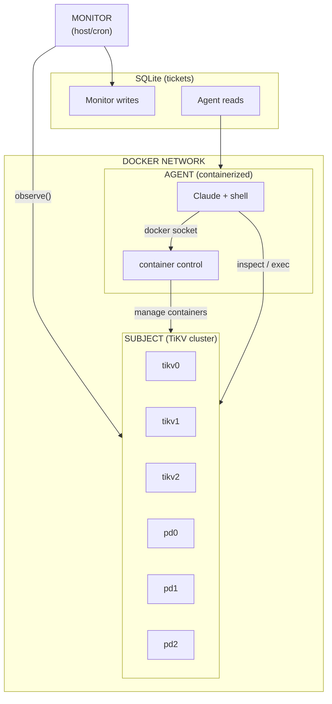
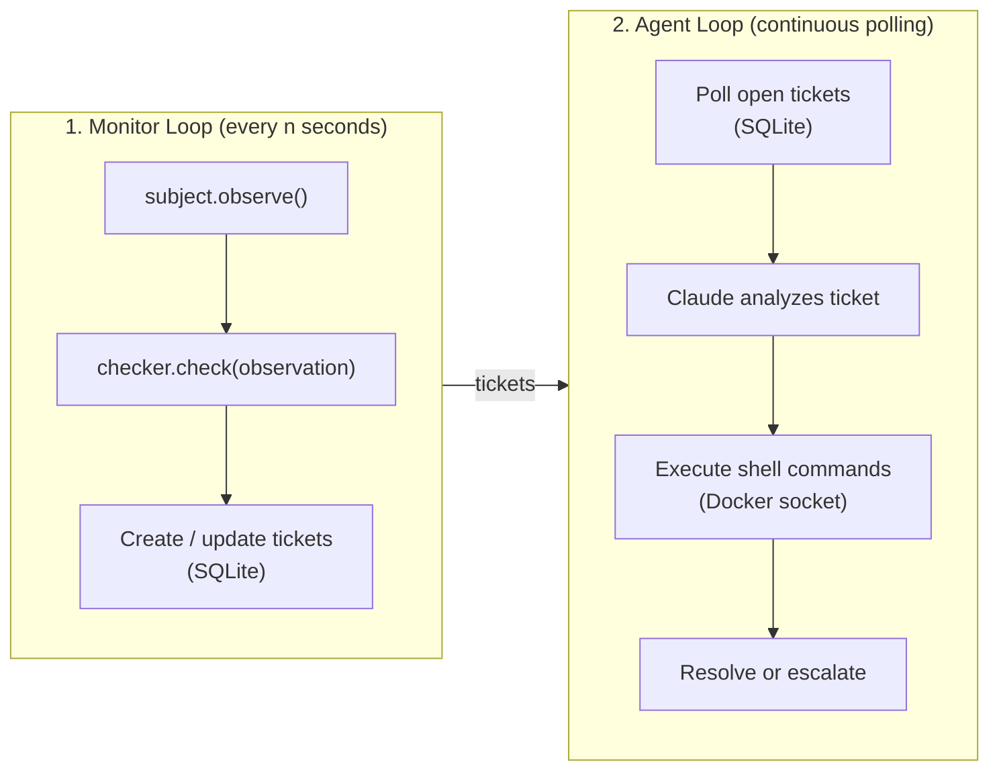

# Operator

An autonomous AI system for monitoring and remediating distributed systems. Operator continuously observes infrastructure, detects invariant violations, and uses Claude to diagnose and fix issues via shell commands.

## Architecture

Operator implements a three-component control loop:



### Components

| Component | Description |
|-----------|-------------|
| **Monitor** | Daemon that polls the subject at regular intervals, checks invariants, and creates tickets for violations |
| **Agent** | Containerized AI (Claude) that processes tickets, diagnoses issues, and executes shell commands to remediate |
| **Subject** | The distributed system being monitored (TiKV cluster, rate limiter, etc.) |

### Data Flow



## Demo

The demo provides an interactive terminal UI that walks through a complete fault injection and recovery cycle.

### What It Does

1. **Shows cluster health** — Displays baseline metrics for a healthy cluster
2. **Generates load** — Starts a YCSB workload against the cluster
3. **Injects a fault** — Kills a TiKV node (or rate limiter node)
4. **Detects the issue** — Monitor identifies the invariant violation and creates a ticket
5. **AI diagnoses** — Claude analyzes metrics, logs, and cluster state
6. **Recovers** — Agent executes remediation commands (e.g., restart the node)
7. **Verifies health** — Shows the cluster returned to a healthy state

### Running the Demo

```bash
# TiKV cluster demo (default)
./scripts/run-demo.sh tikv

# Rate limiter demo
./scripts/run-demo.sh ratelimiter
```

The script handles:
- Starting the Docker Compose stack (cluster + observability)
- Clearing any existing tickets
- Launching the interactive TUI

### Requirements

- Docker and Docker Compose
- Python 3.12+
- `uv` package manager
- Anthropic API key in environment

## Evaluation System

The eval system runs structured chaos engineering experiments (campaigns) to measure operator performance across different fault scenarios and subjects.

See [`eval/README.md`](eval/README.md) for setup and usage — including how to run local smoke tests and cloud campaigns.

## Project Structure

```
packages/
├── operator-core/          # Main package (monitor, agent, CLI)
└── operator-protocols/     # Subject & InvariantChecker protocols

subjects/
├── tikv/                   # TiKV subject implementation
├── ratelimiter/            # Rate limiter subject implementation
└── chat-db-app/            # Chat DB App subject (FastAPI + PostgreSQL)

demo/                       # Interactive TUI demo
eval/                       # Evaluation harness and analysis
scripts/                    # Helper scripts (run-demo.sh, etc.)
```

## Quick Start

```bash
# Install dependencies
uv sync

# Set API key
export ANTHROPIC_API_KEY=your_key

# Run the demo
./scripts/run-demo.sh tikv
```
