# Eval — Chaos Engineering Framework

Runs **campaigns** of **trials** to measure how well the operator detects and resolves infrastructure problems.

<p align="center">
  
</p>

## Concepts

- **Campaign** — a matrix of (subject x chaos_type x trials_per_combination). Defined in YAML, produces a set of trials.
- **Trial** — one execution cycle: reset subject, inject chaos, wait for detection, wait for resolution, score the outcome.
- **Variant** — agent configuration (model, system prompt, tools). Used for A/B testing.
- **Scoring** — time-to-detect, time-to-resolve, win rate, command analysis.

## Prerequisites

- Docker and Docker Compose running
- Python 3.12+
- `uv` package manager
- `ANTHROPIC_API_KEY` set in environment (or in `.env` at repo root)

## Quick Start

```bash
cd eval

# Run a smoke test (3 trials, ~5 min)
uv run eval run campaign campaigns/smoke-tests/tikv-smoke.yaml

# Run a single trial
uv run eval run --subject tikv --chaos node_kill --trials 1

# View results
uv run eval list
uv run eval analyze <campaign_id>
```

## Campaign Reference

### Smoke Tests

| Campaign | Subject | Chaos types |
|----------|---------|-------------|
| `smoke-tests/tikv-smoke.yaml` | tikv | node_kill, latency, network_partition |
| `smoke-tests/tikv-cloud-smoke.yaml` | tikv | node_kill (cloud) |
| `smoke-tests/chatdb-cloud-smoke.yaml` | chat-db-app | load_pressure (cloud) |

### Operations — TiKV

| Campaign | Chaos types | Notes |
|----------|-------------|-------|
| `operations/tikv-node-kill.yaml` | node_kill | Single type, 1 trial |
| `operations/tikv-cascading-failures.yaml` | pd_leader_kill, node_kill | Control plane + data node |
| `operations/tikv-diagnostic-difficulty.yaml` | process_pause, packet_loss, asymmetric_partition | Hard-to-diagnose faults |
| `operations/tikv-subtle-gradual.yaml` | leader_concentration, process_pause | Subtle performance degradation |
| `operations/tikv-all-chaos-local.yaml` | All 9 local chaos types | 3 trials each + baseline |
| `operations/tikv-all-chaos-cloud.yaml` | All 10 chaos types incl. disk_pressure | 3 trials each + baseline (cloud) |
| `operations/tikv-cloud-exotic-chaos.yaml` | process_pause, packet_loss, asymmetric_partition, pd_leader_kill, leader_concentration | Cloud exotic types |
| `operations/tikv-cloud-latency-test.yaml` | latency | Cloud latency test |

### Coding — Chat-DB-App Core Defects

| Campaign | Chaos types | Notes |
|----------|-------------|-------|
| `coding/chatdb-code-fix.yaml` | load_pressure | Legacy load test |
| `coding/chatdb-all-defects.yaml` | missing_index, pool_exhaustion, streaming_txn, counter_race | All 4 core defects |
| `coding/chatdb-missing-index.yaml` | missing_index | Sequential scan on messages |
| `coding/chatdb-pool-exhaustion.yaml` | pool_exhaustion | Unbounded pool hits max_connections |
| `coding/chatdb-streaming-txn.yaml` | streaming_txn | Long-held transactions |
| `coding/chatdb-counter-race.yaml` | counter_race | Read-modify-write race |
| `coding/chatdb-correlated-subquery.yaml` | correlated_subquery | N+1 query pattern |
| `coding/chatdb-fulltext-search.yaml` | fulltext_search | Missing full-text index |
| `coding/chatdb-read-scale.yaml` | read_scale | Read replica needed |
| `coding/chatdb-unbounded-results.yaml` | unbounded_results | Missing pagination |
| `coding/chatdb-write-amplification.yaml` | write_amplification | Excessive writes |
| `coding/chatdb-write-contention.yaml` | write_contention | Lock contention |

### Coding — Chat-DB-App Notification Subsystem

| Campaign | Chaos types |
|----------|-------------|
| `coding/chatdb-notification-cleanup.yaml` | notification_cleanup |
| `coding/chatdb-notification-counter.yaml` | notification_counter |
| `coding/chatdb-notification-fanout.yaml` | notification_fanout |
| `coding/chatdb-notification-mark-read.yaml` | notification_mark_read |
| `coding/chatdb-notification-n-plus-one.yaml` | notification_n_plus_one |
| `coding/chatdb-notification-payload.yaml` | notification_payload |
| `coding/chatdb-notification-poll-idle.yaml` | notification_poll_idle |
| `coding/chatdb-notification-realtime.yaml` | notification_realtime |
| `coding/chatdb-notification-serialize.yaml` | notification_serialize |

### Coding — Chat-DB-App Continuous/Evolution

| Campaign | Chaos types | Notes |
|----------|-------------|-------|
| `coding/chatdb-continuous-defects.yaml` | missing_index, pool_exhaustion, streaming_txn | No reset between trials |
| `coding/chatdb-continuous-evolution.yaml` | 18 chaos types stacked | Full evolution run, continuous |
| `coding/chatdb-cloud-continuous-evolution.yaml` | 18 chaos types stacked | Cloud variant of above |

### Coding — Chat-DB-App-Shard (Horizontal Scaling)

| Campaign | Chaos types | Notes |
|----------|-------------|-------|
| `coding/chatdb-db-sharding.yaml` | db_sharding | 15min timeout |
| `coding/chatdb-db-sharding-cloud.yaml` | db_sharding | Cloud variant |
| `coding/chatdb-shard-baseline.yaml` | db_sharding | Passive "consider scaling" prompt |
| `coding/chatdb-shard-nudge.yaml` | db_sharding_nudge | Narrative prompt, closes escape hatches |
| `coding/chatdb-shard-direct.yaml` | db_sharding_direct | Explicit "implement sharding" prompt |
| `coding/chatdb-shard-gradient-cloud.yaml` | db_sharding, db_sharding_nudge, db_sharding_direct | Prompt gradient A/B test (cloud) |
| `coding/chatdb-shard-escalation-cloud.yaml` | db_sharding_direct, shard_fanout, blob_storage, online_migration | 4-phase continuous (cloud) |
| `coding/chatdb-shard-escalation-opus-cloud.yaml` | db_sharding_direct, shard_fanout, blob_storage, online_migration | 4-phase with Opus variant (cloud) |
| `coding/chatdb-shard-blob-cloud.yaml` | db_sharding_direct, shard_fanout, blob_storage | 3-phase continuous (cloud) |
| `coding/chatdb-shard-migration-cloud.yaml` | db_sharding_direct, shard_fanout, blob_storage, online_migration | Full 4-phase (cloud) |
| `coding/chatdb-shard-blob-migration-cloud.yaml` | db_sharding_direct, shard_fanout, blob_storage, online_migration | 4-phase, longer timeouts (cloud) |

### Coding — Chat-DB-App Cloud

| Campaign | Chaos types | Notes |
|----------|-------------|-------|
| `coding/chatdb-cloud-all-defects.yaml` | missing_index, pool_exhaustion, streaming_txn, counter_race | Cloud variant |
| `coding/chatdb-cloud-load-stress.yaml` | load_pressure | 50 users, 0.6 stream ratio (cloud) |
| `coding/chatdb-cloud-pool-exhaustion.yaml` | pool_exhaustion | Cloud variant |
| `coding/chatdb-cloud-debug-edit.yaml` | debug_code_edit | Inject bugs into app code (cloud) |

### Debug

| Campaign | Subject | Notes |
|----------|---------|-------|
| `debug/chatdb-notification-validation.yaml` | chat-db-app | 10 notification + query chaos types |
| `debug/chatdb-shard-retry-nudge-direct.yaml` | chat-db-app-shard | Nudge + direct prompt retry |
| `debug/chatdb-shard-blob-smoke.yaml` | chat-db-app-shard | Short blob timeout (300s) |
| `debug/chatdb-shard-migration-smoke.yaml` | chat-db-app-shard | Short migration timeout (300s) |
| `debug/chatdb-search-invariant-smoke.yaml` | chat-db-app-shard | Tests search_latency invariant |
| `debug/chatdb-checker-baseline.yaml` | chat-db-app | 7 chaos types, rule-based checker |
| `debug/chatdb-checker-llm.yaml` | chat-db-app | Same 7 types, LLM-based checker |

## Running Campaigns

### Local

```bash
cd eval
uv run eval run campaign campaigns/<campaign-file>.yaml
```

### Cloud (GCP)

Cloud campaigns provision GCP VMs, run trials there, and store results in a shared PostgreSQL database. See [CLOUD.md](CLOUD.md) for architecture details.

#### Cloud prerequisites

```bash
gcloud auth login
gcloud compute instances list  # Verify auth works
```

Ensure `.env` at repo root has:

| Variable | Purpose |
|----------|---------|
| `ANTHROPIC_API_KEY` | Agent LLM calls |
| `EVAL_DATABASE_URL` | Cloud PostgreSQL for distributed execution |
| `GCP_PROJECT` | GCP project ID |
| `CHATDB_APP_IMAGE` | Chat DB App: pre-built app image |
| `CHATDB_LOADGEN_IMAGE` | Chat DB App: pre-built loadgen image |

#### Enqueue and run

```bash
cd eval
source ../.env

# Enqueue
uv run eval run campaign campaigns/smoke-tests/tikv-cloud-smoke.yaml --cloud=gcp

# Start a worker
GIT_SHA=$(git rev-parse --short HEAD)
uv run eval worker start --cloud=gcp \
  --operator-image=us-central1-docker.pkg.dev/${GCP_PROJECT}/eval/operator:${GIT_SHA}
```

#### Concurrent campaigns

Use `--campaign` to scope workers to a specific campaign:

```bash
# Campaign A (terminal 1)
uv run eval run campaign campaigns/operations/tikv-all-chaos-cloud.yaml --cloud=gcp  # → campaign 109
uv run eval worker start --cloud=gcp --id=c109-1 --campaign=109 \
  --operator-image=us-central1-docker.pkg.dev/${GCP_PROJECT}/eval/operator:${GIT_SHA}

# Campaign B (terminal 2)
uv run eval run campaign campaigns/coding/chatdb-cloud-all-defects.yaml --cloud=gcp  # → campaign 110
uv run eval worker start --cloud=gcp --id=c110-1 --campaign=110 \
  --operator-image=us-central1-docker.pkg.dev/${GCP_PROJECT}/eval/operator:${GIT_SHA}
```

## Analysis

```bash
cd eval

# List campaigns
uv run eval list
uv run eval list --notable

# Mark as notable / annotate
uv run eval notable <campaign_id>
uv run eval note <campaign_id> "Reference baseline for TiKV node_kill"

# Score a campaign
uv run eval analyze <campaign_id>
uv run eval analyze <campaign_id> --commands    # Include LLM command classification

# Compare campaigns
uv run eval compare <id1> <id2>
uv run eval compare-baseline <campaign_id>

# Web UI
uv run eval viewer                              # http://127.0.0.1:8000
```

For cloud results, add `--remote` to commands above.

## Exporting & Publishing

```bash
cd eval

# Export campaign as self-contained HTML
uv run eval export <campaign_id>
uv run eval export <campaign_id> --remote       # From cloud database

# Publish to operator-campaigns repo
uv run eval publish <campaign_id> --remote
uv run eval publish <campaign_id> --remote --dry-run
```

Requires `OPERATOR_RESULTS_REPO_LOCATION` in `.env` for publishing.

## Campaign Config Reference

```yaml
name: my-campaign
subjects: [tikv]                 # tikv, chat-db-app, or chat-db-app-shard
chaos_types:
  - type: node_kill
  - type: latency
    params: { min_ms: 50, max_ms: 150 }
trials_per_combination: 3        # Repetitions per subject/chaos combo
parallel: 1                      # Parallel instances (isolated Docker projects)
cooldown_seconds: 10             # Wait between trials
include_baseline: false          # Run no-chaos baseline trials
continuous: false                # Skip reset between trials (stacking defects)
variant: default                 # Agent config variant (see eval/variants/)
cloud:                           # Omit for local campaigns
  provider: gcp
  operator:
    enabled: true
    image: us-central1-docker.pkg.dev/$GCP_PROJECT/eval/operator:${GIT_SHA}
```

## Chaos Types

### TiKV

| Type | What it does |
|------|-------------|
| `node_kill` | SIGKILL a TiKV container |
| `latency` | tc netem delay (params: `min_ms`, `max_ms`) |
| `network_partition` | iptables block TiKV ↔ peers and TiKV ↔ PD |
| `process_pause` | SIGSTOP/SIGCONT (freeze process) |
| `packet_loss` | tc netem intermittent loss (param: `percent`) |
| `asymmetric_partition` | Block traffic to one peer only |
| `pd_leader_kill` | Kill a PD control plane node |
| `leader_concentration` | Concentrate all region leaders on one store |
| `disk_pressure` | Fill tmpfs (cloud only) |

### Chat-DB-App

| Type | What it triggers |
|------|-----------------|
| `missing_index` | Sequential scans (no index on messages) |
| `pool_exhaustion` | Unbounded pool hits max_connections |
| `streaming_txn` | Connections stuck idle-in-transaction |
| `counter_race` | Read-modify-write race on token counter |
| `load_pressure` | Alias for pool_exhaustion |
| `correlated_subquery` | N+1 query pattern |
| `fulltext_search` | Missing full-text search index |
| `read_scale` | Read replica needed |
| `unbounded_results` | Missing pagination |
| `write_amplification` | Excessive write operations |
| `write_contention` | Lock contention under concurrent writes |
| `notification_*` | 9 notification subsystem defects (fanout, counter, realtime, poll_idle, mark_read, n_plus_one, payload, cleanup, serialize) |

### Chat-DB-App-Shard

| Type | What it triggers |
|------|-----------------|
| `db_sharding` | 2M messages on constrained PG, needs horizontal sharding |
| `db_sharding_nudge` | Same setup, narrative prompt closing escape hatches |
| `db_sharding_direct` | Same setup, explicit "implement sharding" prompt |
| `shard_fanout` | Cross-shard query optimization (requires prior sharding) |
| `blob_storage` | Large message storage in blob store (requires prior sharding) |
| `online_migration` | Zero-downtime schema migration (requires prior phases) |

## Recovering from Cloud Failures

```bash
# Release stale work items (worker crashed)
uv run eval worker release-stale --remote

# Check for orphaned VMs
gcloud compute instances list --filter="name~chatdb OR name~tikv-eval"

# Delete orphaned VMs
gcloud compute instances delete <name> --zone=us-central1-a --quiet
```

## Running Tests

```bash
cd eval
uv run pytest tests/
```
